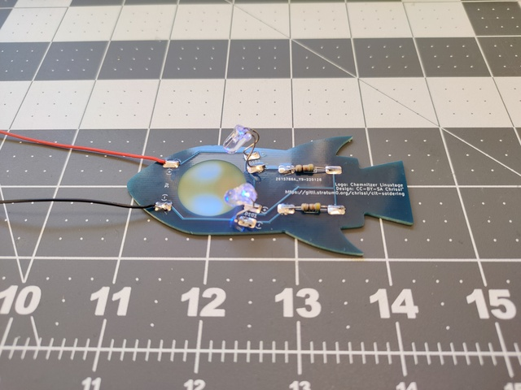
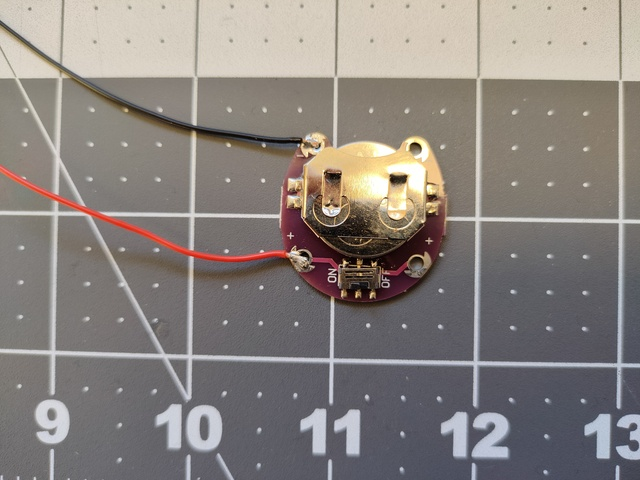

# CLT Soldering Kits

## Raketenpinguin

Der Raketenpinguin ist ein einfaches Löt-Kit,
dass als Halsband getragen werden kann.

Zum Löten benötigst du einen einfachen Lötkolben,
etwas Lötzinn und einen Seitenschneider.

### Inhalt

* Raketenpinguin-Platine
* 2 Widerstände, 100 Ohm
* 2 LEDs
* 2 Leitungen, ca 40cm
* Batteriehalter
* Batterie, CR2032

### Anleitung

Schau dir am besten vorher die Fotos an.
Damit ist die erklärung vermutlich viel einfacher zu
lesen.

* Lege die Widerstände auf die Widerstands-Pads und
  schneide die Beinchen außen an den Pads ab.
* Löte die Widerstände auf die Widerstands-Pads.
* Knicke die LED-Beinchen bei ca 1/2 der Länge um 90°
  ab.
* Löte die LEDs knapp hinter dem Knick auf die Platine.
* Das längere Beinchen muss auf das ``(+)`` Pad.
* Isoliere die Kabel am Ende etwas ab und verzinne die Enden.
* Danach kannst du das rote Kabel an  beiden Seiten 
  an den ``(+)``-Anschluss und
  das schwarze Kabel an den ``(-)``-Anschluss an.

