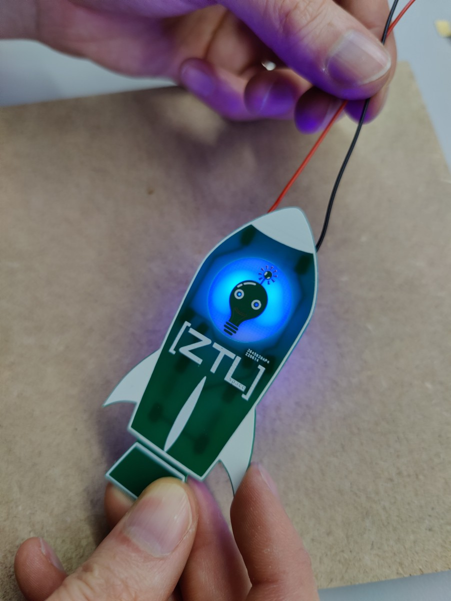
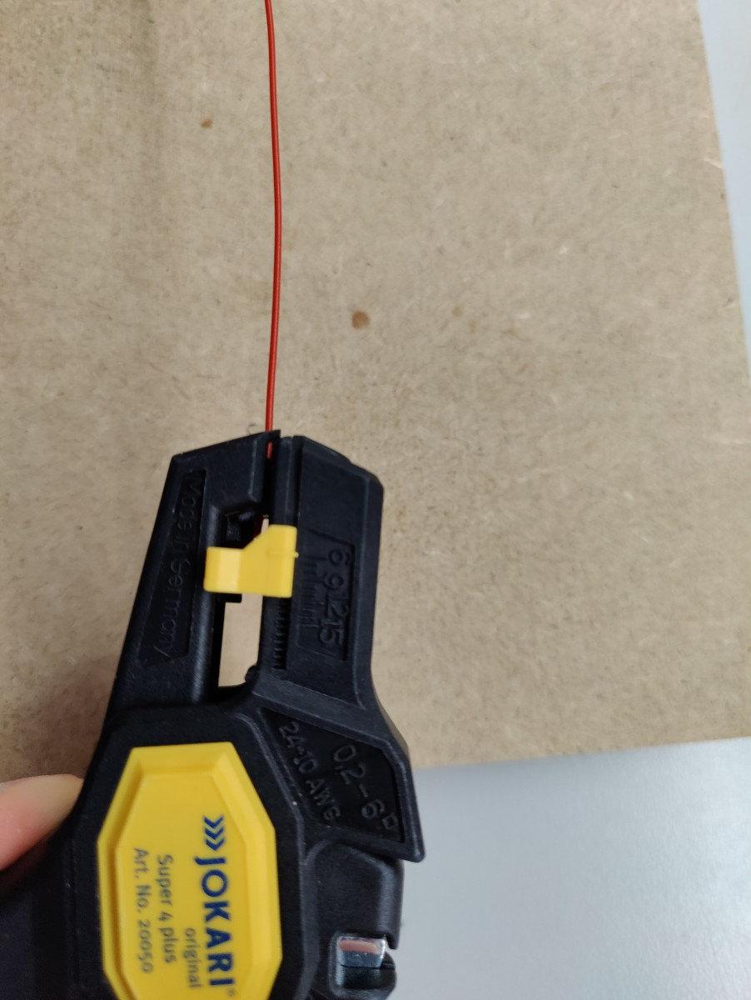
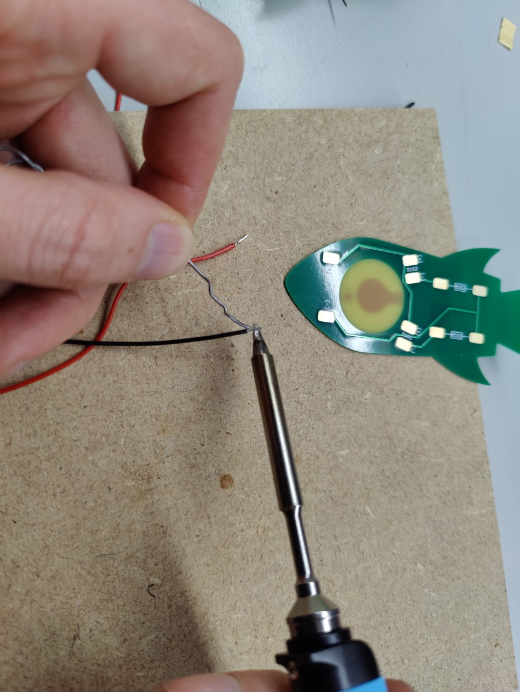
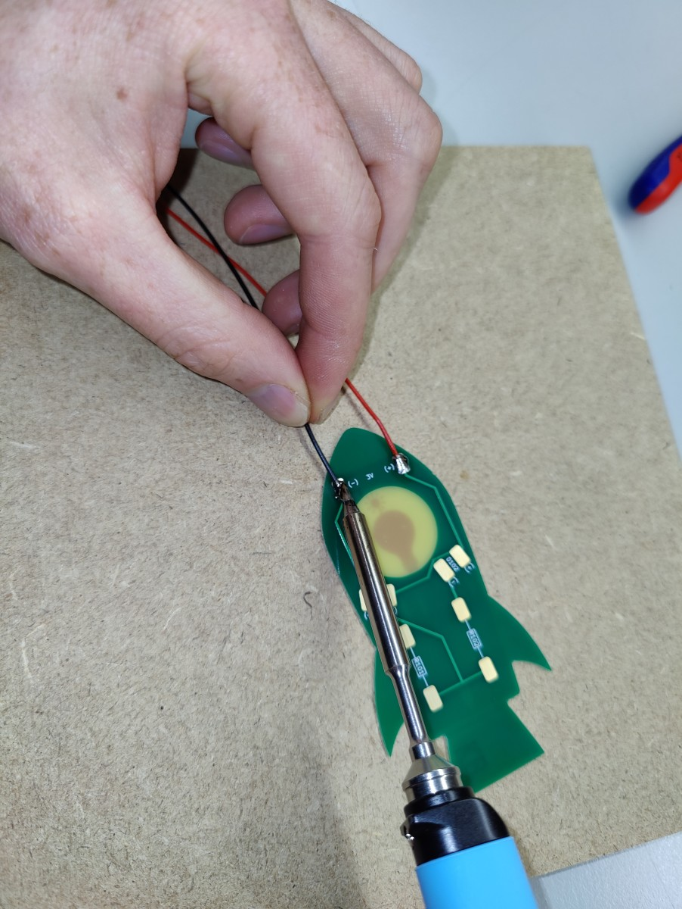
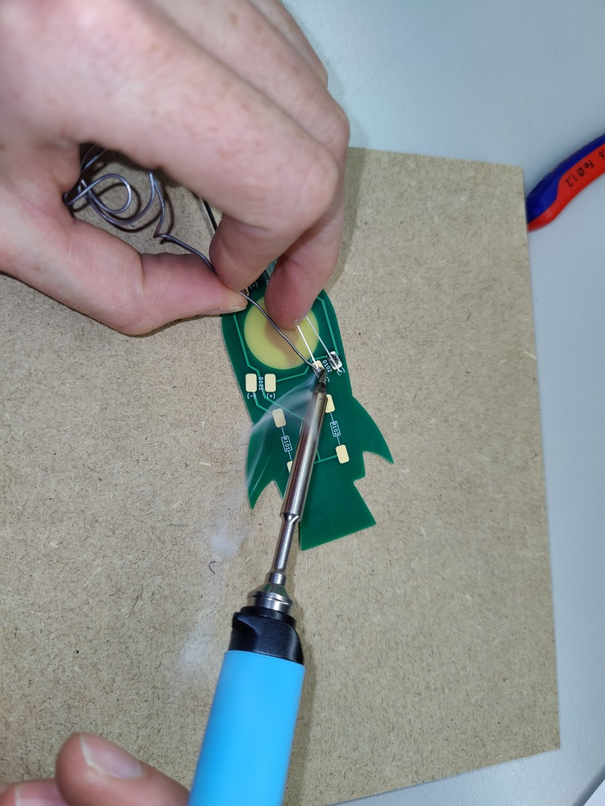
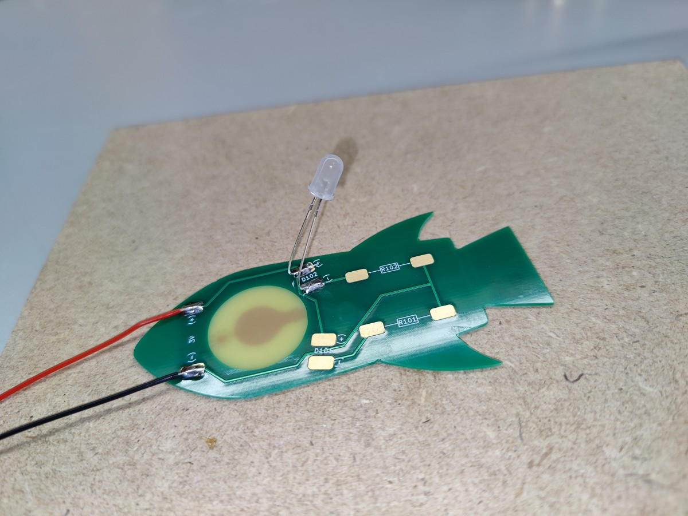
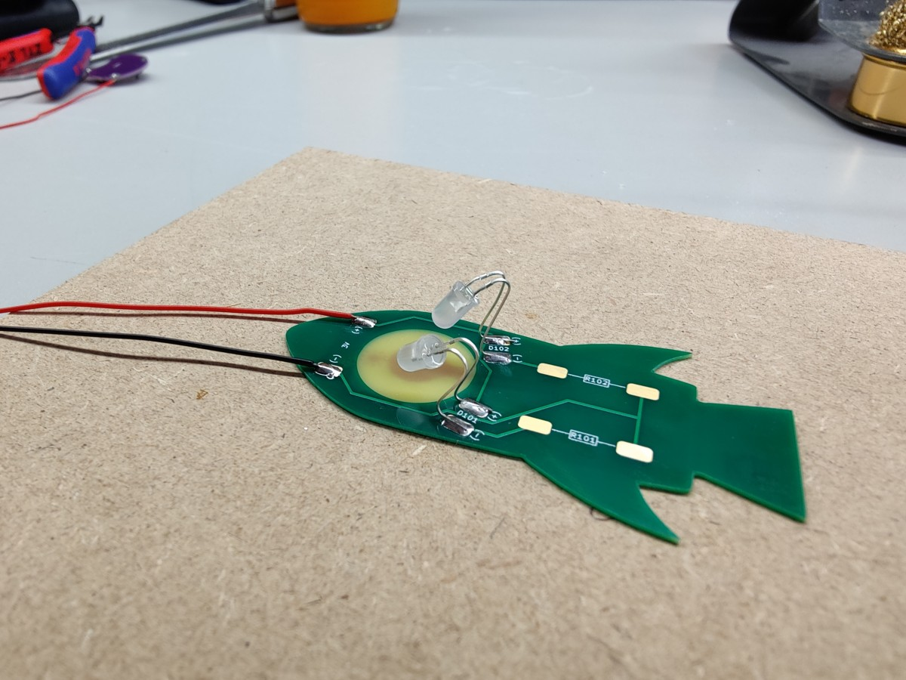
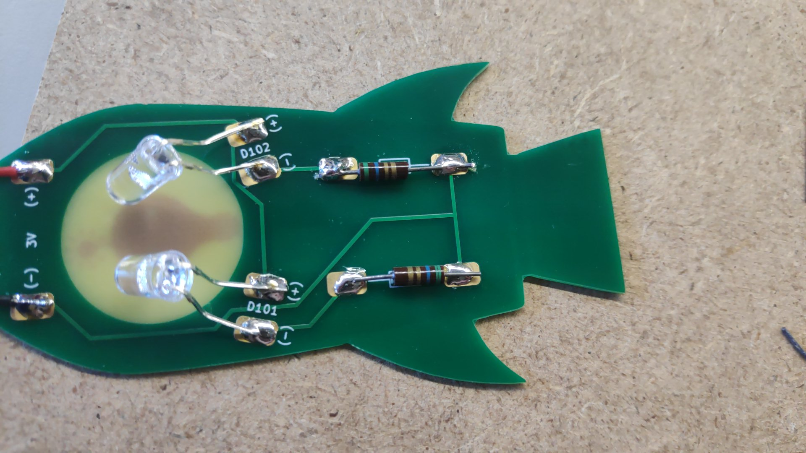
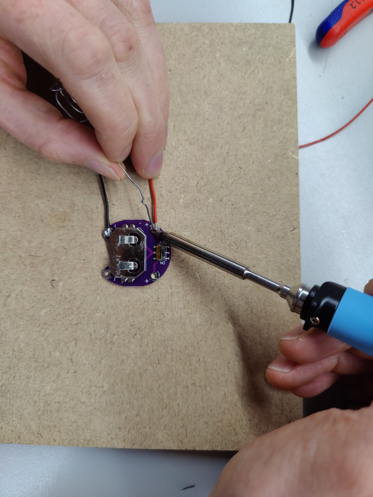
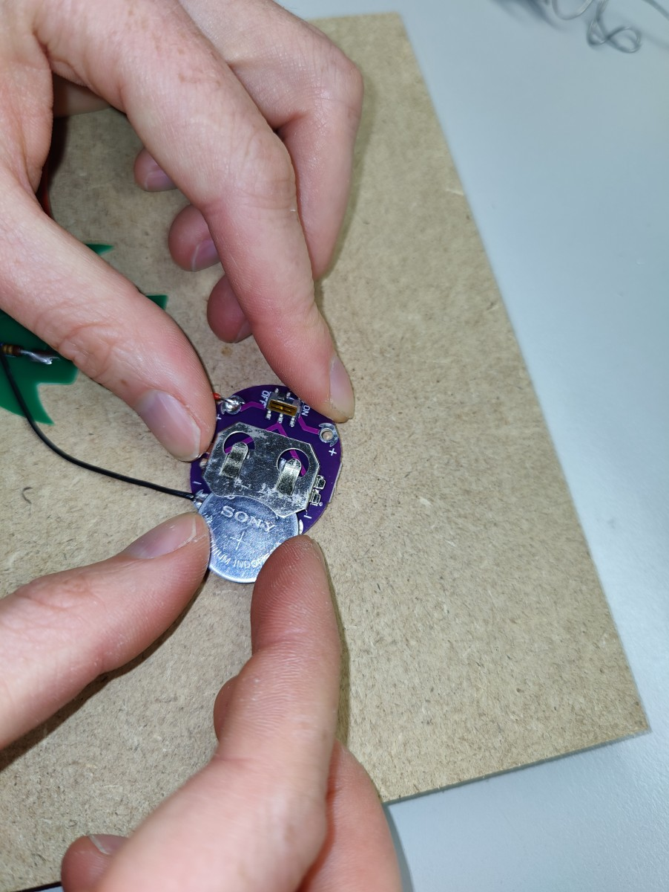

# Tag der offenen Space Tür - Robo-Rocket-Badge

Das Robo-Rocket-Badge ist ein einfaches Löt-Kit,
dass als Halsband getragen werden kann.

Zum Löten benötigst du einen einfachen Lötkolben,
etwas Lötzinn, eine Abisolierzange und einen Seitenschneider.

### Material

* Robo-Rocket-Platine
* 2 Widerstände, 5,6 Ohm
* 2 LEDs (Blau oder Farbwechsel langsam oder Farbwechsel schnell)
* 2 Leitungen, ca 40cm (schwarz und rot)
* Batteriehalter
* Batterie, CR2032

### Anleitung

Schau dir am besten vorher die Beispiel-Badges auf dem Tisch an.
Damit ist die Erklärung vermutlich viel einfacher zu
lesen.

* Die rote und die schwarze Leitung auf beiden Seiten mit der Abisolierzange abisolieren.

* Alle vier abisolierten Stellen mit Lötzinn verzinnen.

* Anlöten der Leitungen. Dazu die beiden Pads mit ``(+)`` und ``(-)`` an der Spitz der Rakete verzinnen und die rote Leitung an ``(+)`` und die schwarze Leitung an ``(-)`` anlöten.

* Verlöte die LEDs an den Markierungen ``D101`` und ``D102``. Das längere Beinchen muss auf das ``(+)`` Pad.

* Die LEDs knapp über dem Pad um 90° nach oben biegen. Am besten mit dem Finger auf beide Pads drücken, damit diese beim Umbiegen der LED nicht abreißen können.

* Dann die Led-Köpfe wieder nach unten biegen, in Richtung Roboter-Kopf.

* Die Beinchen der beiden Widerstände einkürzen und an den Markierungen ``R101`` und ``R102`` anlöten.

* Zuletzt die beiden Leitungen am Batteriehalter festlöten, die Knopfzelle einsetzen und mit dem Schalter einschalten.

Besonderer Dank geht an chrissi^ (https://gitli.stratum0.org/chrissi/clt-soldering), der das Badge ursprünglich entwickelt hat.